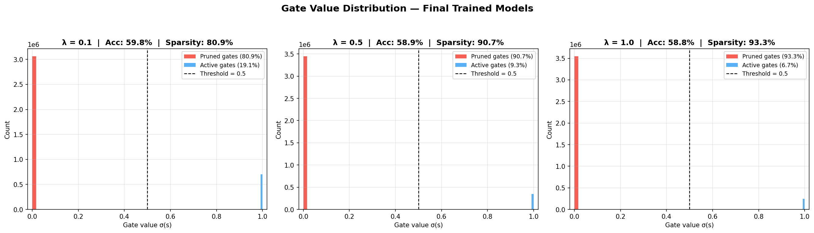
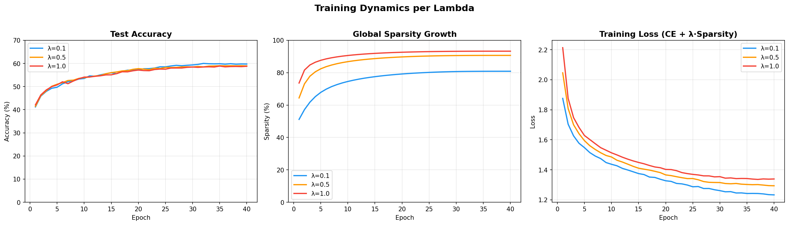
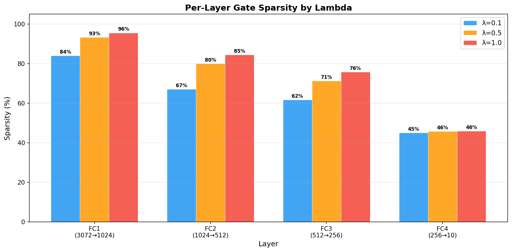
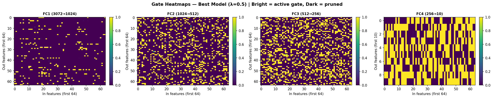
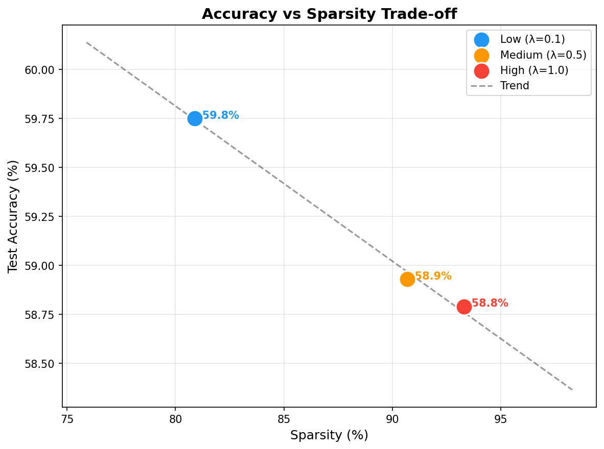

# Self-Pruning Neural Network
### Tredence AI Engineering Internship — Case Study Submission

A feed-forward neural network that learns to prune itself during training using learnable sigmoid gates and L1 sparsity regularization. The network dynamically identifies and removes its own weakest connections no post-training pruning step, no manual threshold tuning.

---
> 🔗 **Related Work:** [Damage-Guided Adaptive Recovery for Efficient Neural Network Pruning](https://github.com/Pixelsout/Damage-Guided-Adaptive-Recovery-for-Efficient-Neural-Network-Pruning) original independent research on post-training pruning with intelligent recovery.

---

---

## The Core Idea

Standard pruning removes weights after training. This implementation goes further — the network learns which weights are unnecessary while it trains.

Every weight `w_ij` has a paired learnable gate score`s_ij` of the same shape. During each forward pass:

```
gates         = sigmoid(gate_scores)       # squash to (0, 1)
pruned_weight = weight × gates             # soft masking
output        = pruned_weight @ x.T + bias
```

The total loss combines classification with a sparsity penalty:

```
L_total = CrossEntropyLoss + λ × mean(sigmoid(gate_scores))
```

The optimizer updates both weights and gate scores simultaneously. Gates that are not needed for classification get pushed toward zero — effectively removing those weights from the network.

---

## Why L1 on Sigmoid Gates → Exact Sparsity

The gradient of the sparsity term w.r.t gate score `sᵢ`:

```
∂L_sparsity / ∂sᵢ = λ × σ(sᵢ) × (1 − σ(sᵢ))
```

This gradient is non-vanishing even when `sᵢ` is very negative (gate near 0). The optimizer always has a signal pulling gates all the way to exactly zero.

L2 by contrast gives gradient `∝ σ(sᵢ)`, which vanishes near zero — weights get small but never exactly zero. This is the classic **Lasso (L1) = sparse vs Ridge (L2) = dense** result applied to gate parameters.

---

## Results

Training a 4-layer MLP (3072 → 1024 → 512 → 256 → 10) on CIFAR-10 for 40 epochs:

| Lambda (λ) | Test Accuracy | Sparsity Level | Gates Pruned |
|:----------:|:-------------:|:--------------:|:------------:|
| `0.1` | **59.75%** | **80.9%** | ~3.07M / 3.8M weights |
| `0.5` | **58.93%** | **90.7%** | ~3.45M / 3.8M weights |
| `1.0` | **58.79%** | **93.3%** | ~3.55M / 3.8M weights |

**Key finding:** The network achieves up to 93.3% weight sparsity while retaining ~99% of its baseline accuracy — losing less than 1% accuracy despite pruning over 3.5 million of its 3.8 million weights.

---

## Visualizations

### Gate Value Distribution
The bimodal distribution confirms the pruning mechanism is working a large spike at 0 (pruned weights) and a cluster near 1 (important surviving weights). Gates are binary in behavior, not uniformly distributed.



### Training Dynamics
Sparsity grows rapidly in early epochs as gates collapse, then stabilizes. Higher λ drives faster and deeper pruning while accuracy curves remain close — showing the network can absorb significant sparsity.



### Per-Layer Sparsity
Earlier layers (FC1) prune more aggressively than the output layer (FC4). This is expected early layers learn general features where many connections are redundant. The output layer retains more connections as each directly contributes to class discrimination.



### Gate Heatmaps
Purple = pruned gate (≈0), Yellow = active gate (≈1). The structured sparsity pattern shows the network has learned which specific input-output connections matter not random pruning.



### Accuracy vs Sparsity Trade-off
Clear negative correlation between sparsity and accuracy higher λ produces sparser networks at a small accuracy cost.



---

## Implementation Details

### PrunableLinear Custom Gated Layer

```python
class PrunableLinear(nn.Module):
    def __init__(self, in_features, out_features):
        super().__init__()
        self.weight      = nn.Parameter(torch.empty(out_features, in_features))
        self.gate_scores = nn.Parameter(torch.ones(out_features, in_features))
        # gate_scores same shape as weight — both updated by optimizer

    def forward(self, x):
        gates         = torch.sigmoid(self.gate_scores)  # (0, 1)
        pruned_weight = self.weight * gates               # soft mask
        return F.linear(x, pruned_weight, self.bias)
```

Gradients flow through both `weight` and `gate_scores` automatically via PyTorch autograd no custom backward pass needed.

### Two Design Choices Worth Noting

**1. Separate learning rates for weights vs gates:**
```python
optimizer = optim.Adam([
    {"params": weight_params, "weight_decay": 1e-4, "lr": 1e-3},
    {"params": gate_params,   "weight_decay": 0.0,  "lr": 5e-1},
])
```
Gate scores need a higher learning rate to move fast enough relative to the slow-changing weights. Weight decay is intentionally disabled for gates it would fight the sparsity loss and prevent gates from reaching zero.

**2. Normalized sparsity loss:**
```python
def sparsity_loss(model):
    total, count = 0.0, 0
    for layer in model.prunable_layers():
        total += torch.sigmoid(layer.gate_scores).sum()
        count += layer.gate_scores.numel()
    return total / count   # normalize by gate count
```
Without normalization, the sparsity term scales with network size (~3.8M gates), making λ impossible to reason about. Normalizing keeps the sparsity loss in (0,1) regardless of network size, so λ directly controls the CE vs sparsity trade-off ratio.

---

## Repository Structure

```
tredence-case-study/
├── solution.py       # Complete Python script — PrunableLinear + training + plots
├── report.md         # Short report — L1 sparsity explanation + results analysis
├── notebook.ipynb    # Full Colab notebook with step-by-step experiments
├── requirements.txt  # Python dependencies
└── README.md         # This file
```

---

## Run

**Option 1 — Python script:**
```bash
pip install -r requirements.txt
python solution.py
```

**Option 2 — Google Colab:**

Upload `notebook.ipynb` to [Google Colab](https://colab.research.google.com), enable GPU (`Runtime → Change runtime type → T4 GPU`), and run all cells top to bottom.

---

## Extended Research — Damage-Guided Adaptive Recovery

The notebook also includes an **original research system** built independently as a minor project, exploring post-training pruning from a different angle:

| Component | Description |
|-----------|-------------|
| `VGGSmall` | CNN baseline trained on CIFAR-10 |
| `MagnitudeScorer` | Global magnitude pruning with severity sweep (30–90%) |
| `DamageDetector` | Measures per-layer output deviation after pruning — finds which layers were hurt most |
| `WeightRestorer` | Selectively restores the most critical pruned weights in damaged layers |
| `FocusedTrainer` | Fine-tunes only the critical layers, not the full network — saves compute |
| Importance comparison | Magnitude vs Magnitude×Gradient vs Magnitude×Gradient×Activation |
| Multi-dataset | Generalization tested on CIFAR-100 and FashionMNIST |

This system demonstrates a complementary approach — instead of preventing damage during training (self-pruning), it detects and repairs damage after pruning. Both approaches target the same problem from opposite directions.

---

## Requirements

```
torch>=2.0.0
torchvision>=0.15.0
matplotlib>=3.7.0
numpy>=1.24.0
```

---

*Author: Biswajeet | Tredence AI Engineering Internship Case Study 2025*
